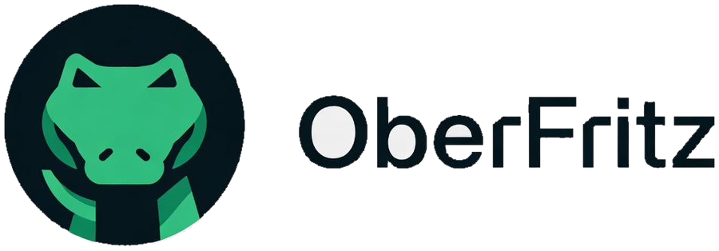

<div align="center">



# OberFritz — Site Institucional

**Tecnologia que trabalha a favor da sua operação.**

[](https://oberfritz.com.br)
[](https://pages.cloudflare.com/)
[](#stack-e-arquitetura)

</div>

---

## Sobre a OberFritz

A **OberFritz** é uma empresa de tecnologia que constrói **sistemas sob medida** para
empresas que cresceram mais rápido que os próprios processos.

A premissa é simples: escrever código é uma das peças da solução, não a solução.
Um sistema entregue sem entender o processo vira mais uma ferramenta que a equipe
evita usar. Por isso todo projeto começa com diagnóstico — entender como a empresa
trabalha de verdade antes da primeira linha de código.

> **Não vendemos sistema. Entregamos previsibilidade, controle e tempo de volta
> para a sua equipe.**

Este repositório contém o **site institucional** da empresa: o material de
apresentação público, com as frentes de solução, modelos de contratação e canais
de contato.

---

## O que fazemos

| Frente | O que resolve |
|---|---|
| **Software sob medida** | Sistemas web, painéis internos e SaaS construídos a partir do processo real da empresa — não de um template. |
| **Infraestrutura e cloud** | Servidores, containers, deploy automatizado e ambientes que não dependem de uma pessoa só. |
| **Automação e IA** | Rotinas que rodam sozinhas, integrações entre ERP, CRM e WhatsApp, agentes de IA no trabalho repetitivo. |
| **Dados e BI** | Informação centralizada, indicadores confiáveis e painéis que mostram onde está o gargalo. |
| **Segurança** | Controle de acesso, backup testado, monitoramento e boas práticas aplicadas antes do problema. |
| **APIs e integrações** | Sistemas que nunca conversaram passando a trabalhar como um só, com documentação. |

---

## Objetivos

O site existe para cumprir quatro funções de negócio:

1. **Qualificar antes da conversa** — explicar o método e o tipo de problema que a
   OberFritz resolve, para que a primeira conversa já comece no assunto certo.
2. **Traduzir tecnologia para quem decide** — o público que assina o contrato
   raramente é da área técnica. Nada de jargão sem tradução.
3. **Gerar contato qualificado** — todo caminho do site desemboca em um diagnóstico
   gratuito via WhatsApp, com a mensagem já preenchida conforme a página de origem.
4. **Mostrar critério técnico pela própria execução** — o site é a primeira amostra
   de trabalho: performance, acessibilidade e código limpo, sem dependências inúteis.

---

## Para quem trabalhamos

Pequenas e médias empresas que chegaram no limite do controle manual — tipicamente
com **operação complexa e ferramentas que não conversam entre si**:

- **Indústria** — ordens de produção, apontamento de chão de fábrica, indicadores.
- **Logística e distribuição** — integração ERP/CRM, rastreio, roteirização.
- **Varejo** — centralização de estoque, vendas e relatórios automáticos.
- **Serviços** — ordens de serviço, agendamento, faturamento e histórico.
- **Agro, saúde e educação** — gestão operacional e substituição de planilhas críticas.

O sinal comum: informação espalhada entre Excel, WhatsApp, e-mail e a cabeça de
alguém da equipe — e nenhuma visão do todo.

---

## Como um projeto acontece

```
01 Consultoria      →  02 MVP           →  03 Desenvolvimento  →  04 Entrega
   1 a 2 semanas       3 a 6 semanas       ciclos de 2 sem.       + sustentação
   diagnóstico         maior gargalo       módulos e integr.      produção e treino
```

Cada etapa só começa quando a anterior gerou uma decisão clara. O diagnóstico é
seu mesmo que o projeto não siga adiante.

---

## Stack e arquitetura

Site **estático puro** — HTML, CSS e JavaScript, sem framework, sem bundler e sem
dependência de CDN de biblioteca. Isso é intencional: carrega rápido, não quebra
com atualização de pacote e hospeda em qualquer lugar.

```
index.html            Home — sequência completa de apresentação
quem-somos.html       Perfil profissional, competências e trajetória
produtos.html         Detalhe das 6 frentes de solução
planos.html           Modelos de contratação + comparativo + FAQ
contato.html          Formulário que abre o WhatsApp preenchido
404.html              Página de erro (noindex)

assets/css/style.css  Estilo único do site
assets/js/site.js     Hero com scroll, malha 3D, carrossel 3D, formulário
assets/img/           Logo, mascote Fritz e foto profissional

_src/                 Fonte das páginas internas + script de build
  build.py            Gera as páginas internas, o sitemap e injeta meta tags
  *.body.html         Corpo de cada página interna

_headers              Cabeçalhos de segurança e cache (Cloudflare Pages)
_redirects            URLs limpas e bloqueio de /_src/
robots.txt            Indexação
sitemap.xml           Gerado pelo build
```

**Detalhes técnicos**

- Tipografia: Bricolage Grotesque (títulos), Instrument Sans (texto) e
  JetBrains Mono (labels e números), via Google Fonts.
- Direção visual "Instrumento": fundo quase-preto, fios de 1px, cantoneiras nos
  painéis e o verde-limão como acento único.
- A malha 3D do hero é desenhada em canvas 2D com projeção em perspectiva
  própria — não depende de Three.js nem de CDN alguma.
- O carrossel de entregas usa CSS 3D (`transform-style: preserve-3d`), gira
  sozinho, pausa no hover e aceita arrastar.
- `prefers-reduced-motion` é respeitado em todo o site.

---

## Rodando localmente

Não há etapa de build para visualizar — basta abrir `index.html` no navegador.
Para servir com URLs corretas:

```bash
python3 -m http.server 8000
# abre em http://localhost:8000
```

### Editando as páginas internas

`quem-somos.html`, `produtos.html`, `planos.html`, `contato.html` e `404.html` são
geradas a partir de `_src/*.body.html`, reaproveitando o menu e o rodapé do
`index.html`. Edite o arquivo em `_src/` e rode:

```bash
python3 _src/build.py
```

O script também regenera o `sitemap.xml` e injeta `canonical` e Open Graph em cada
página. **Editar os `.html` finais direto funciona, mas o próximo build sobrescreve.**

### Dados de contato

Ficam em um lugar só: o bloco `CONFIG` no topo de `assets/js/site.js`
(WhatsApp, e-mail, Instagram, LinkedIn, GitHub). Esses valores alimentam todos os
botões, links e o rodapé das cinco páginas.

---

## Antes de publicar — conteúdo a substituir

Alguns trechos ainda estão com conteúdo de rascunho. Todos estão marcados no
código com `<!-- TROCAR -->`:

- **`_src/quem-somos.body.html`** — nome, cargo, os três parágrafos da bio, os
  números (anos de experiência e projetos), a lista de competências e os quatro
  itens da trajetória.
- **`assets/img/foto-profissional.jpeg`** — sua foto (proporção 3:4, retrato).
  O enquadramento e a correção de cor são feitos pelo CSS. Para usar a foto sem
  tratamento, remova a linha `filter:` da regra `.perfil__frame img`.
- **`index.html`, seção `id="depoimentos"`** — trocar por depoimentos reais de
  clientes.
- **`index.html`, seção `id="projetos"`** — trocar os quatro cards pelos sistemas
  já entregues.
- **`assets/js/site.js`, bloco `CONFIG`** — confirmar WhatsApp, e-mail e redes.

---

## Deploy

Hospedado no **Cloudflare Pages**, com deploy automático a cada push na branch
`main`. Não há comando de build no Cloudflare — as páginas já vão prontas no
repositório e o diretório de saída é a raiz (`/`).

O passo a passo completo de deploy e configuração de DNS está em
**[DEPLOY.md](DEPLOY.md)**.

---

## Contato

**OberFritz** · Santa Catarina, Brasil

- Site: [oberfritz.com.br](https://oberfritz.com.br)
- WhatsApp e e-mail: veja o rodapé do site
- LinkedIn: [vitor-mondardo](https://www.linkedin.com/in/vitor-mondardo)
- GitHub: [@vitormondardo](https://github.com/vitormondardo)

---

<div align="center">
<sub><b>Explique primeiro. Jargão depois.</b></sub>
</div>
